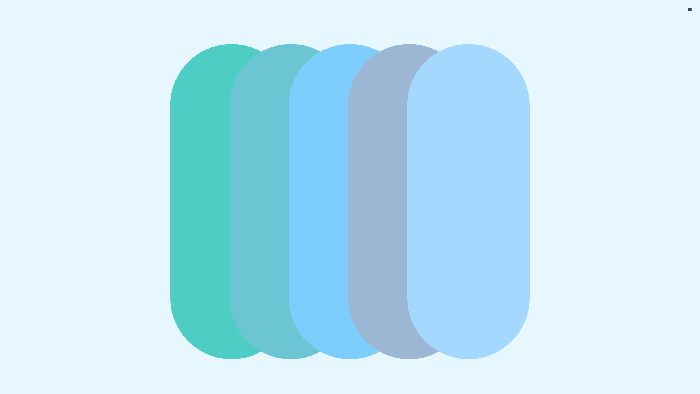
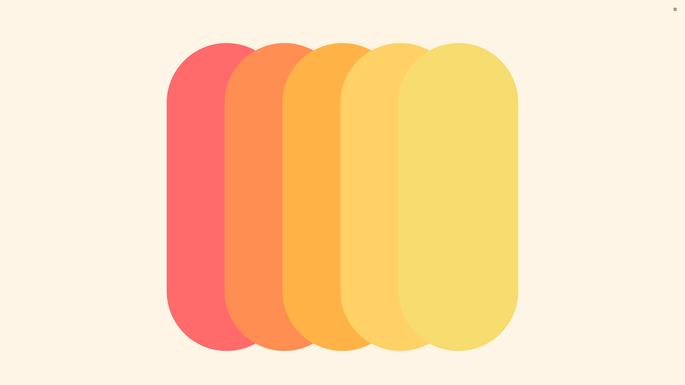

# 🎨 Color Palettes

Color Palettes is a modern web app built with Next.js that allows users to create, customize, and save beautiful color palettes. It features smooth animations using Framer Motion and a clean, responsive UI.

---

## 🖼 Example Screenshot




---

## 🚀 Features
- 🎨 Create custom color palettes with names, background colors, and swatches
- ➕ Add or remove individual colors dynamically
- 💾 Save palettes locally (via localStorage)
- 🧭 Switch between layout styles like circles, cubes, pills, and more
- ✨ Smooth animated transitions powered by Framer Motion

---

## 📦 Tech Stack
- Next.js — React framework for production apps
- Framer Motion — animations and transitions
- Tailwind CSS — utility-first CSS for styling
- shadcn/ui — beautiful and accessible components
- Lucide Icons — open source icon set

---

## 🛠 Getting Started

First, install dependencies:

```bash
npm install
# or
yarn
# or
pnpm install
# or
bun install
```

Then, run the development server:

```bash
npm run dev
# or
yarn dev
```

Open http://localhost:3000 in your browser to see the app.

---

## 🧪 Development Notes
- Customize the layout styles by editing STYLES and getStyles() in app/page.tsx
- UI and color input handled by CustomPaletteForm.tsx
- Palettes are stored in localStorage for persistence
- Animations configured in ColorDisplay.tsx using motion.div

---

## 🧠 Learn More
- Next.js Documentation
- Framer Motion Docs
- Tailwind CSS Docs

---

## 📤 Deploy

Deploy this project instantly with Vercel:

---

## 📄 License

MIT — free to use, modify, and distribute.